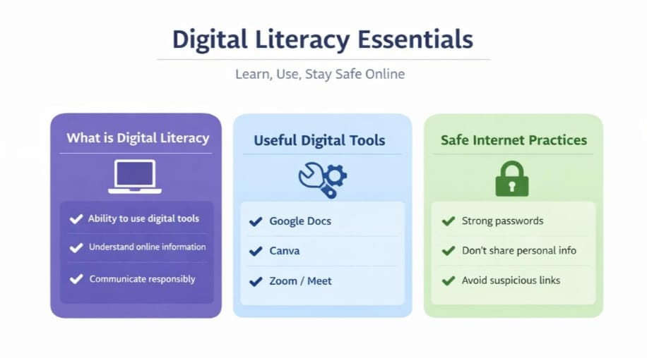
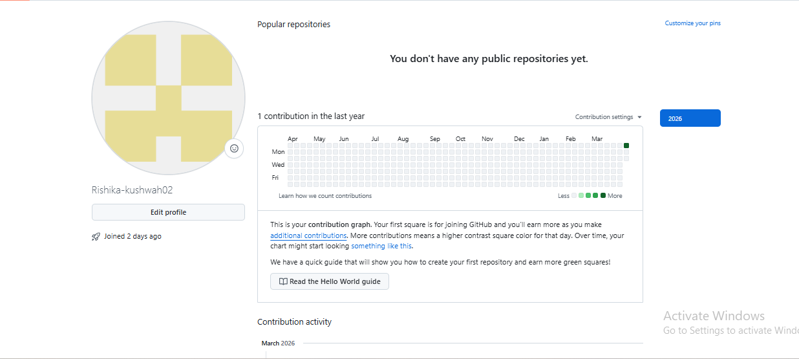
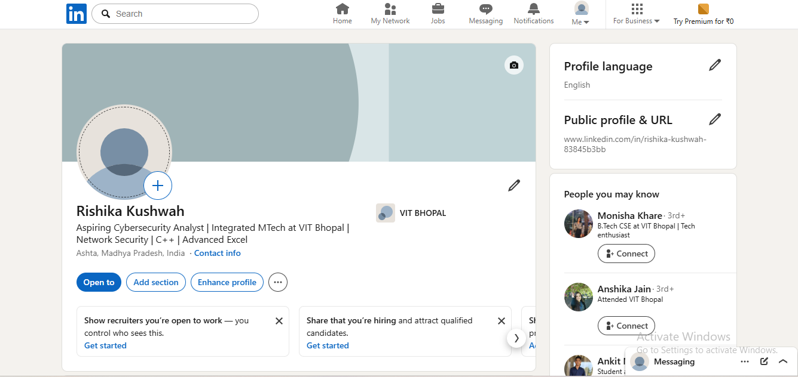
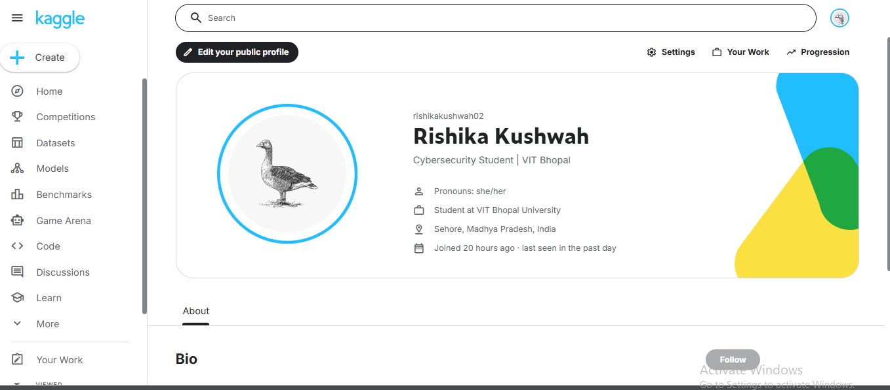
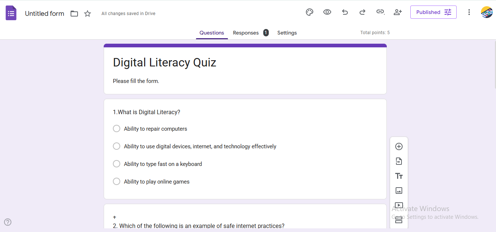
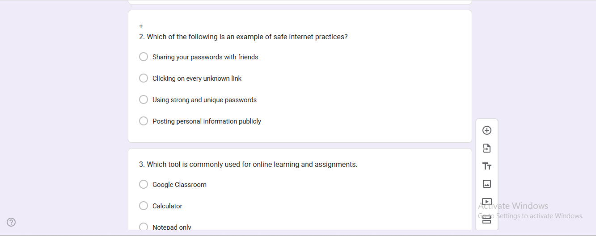
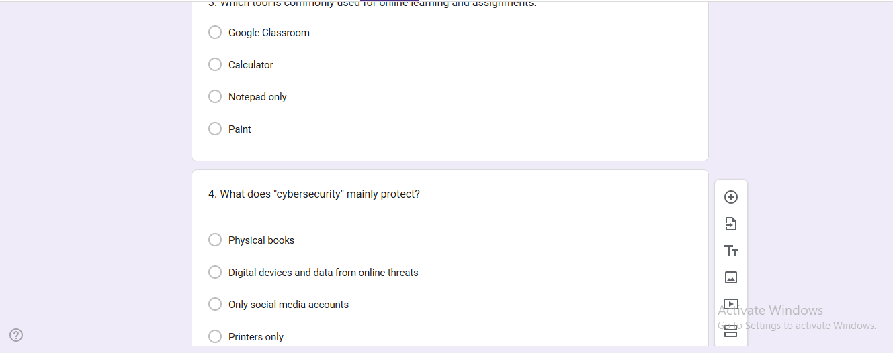
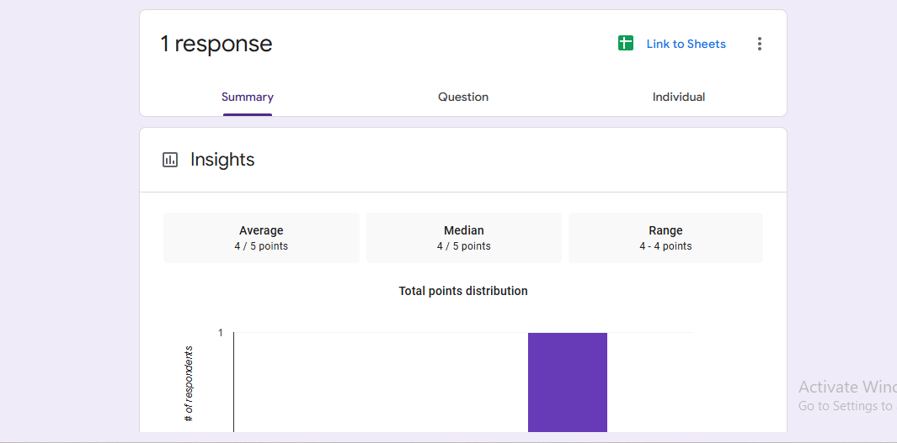

# 🌐 Digital Literacy Project

## 👩‍🎓 Student Details

| Field | Information |
|------|-------------|
| **Name** | Rishika Kushwah |
| **Registration Number** | 25MEI10002 |
| **Branch** | Integrated MTech in Cybersecurity |
| **School** | SCAI |
| **Year** | 1st Year |
| **Course Code** | CSE0001 |

---

## 🎯 Project Objective

This project was developed as part of the **Digital Literacy** course to enhance essential digital skills required in today’s technology-driven world.

As a **Student Digital Ambassador**, I worked on multiple tasks focusing on:
- Digital awareness  
- Online safety  
- Professional communication  
- Use of modern digital platforms  

---

## 📌 Project Overview

This project helped me to:
- Use digital tools effectively  
- Maintain a professional online presence  
- Communicate responsibly  
- Stay safe from cyber threats  

---

## 🖼️ Task 1 – Digital Literacy Infographic

**Tool Used:** Canva  

**Description:**  
Created a one-page infographic explaining digital literacy, useful tools, and safe internet practices.

**Outcome:**  
Improved ability to present information visually in a clear and engaging way.

**File:**  

---

## 💼 Task 2 – Digital Portfolio

**Platforms:** GitHub | LinkedIn | Kaggle  

**Description:**  
Created professional profiles to build a strong online presence.

**Outcome:**  
Understood the importance of maintaining a professional digital identity.

**Files:**

**GitHub Profile:**  

**LinkedIn Profile:**  

**Kaggle Profile:**  

---

## 💻 Task 3 – Coding & Collaboration

### 🔹 Part A – Coding Platform
- **Platform:** HackerRank  
- **Activity:** Completed a beginner-level coding problem  

### 🔹 Part B – Google Form
- **Project:** Digital Literacy Awareness Quiz (5 Questions)  
- **Data Handling:** Collected and analyzed responses using Google Sheets  

🔗 **Digital Literacy Quiz:**  
[View Quiz](https://forms.gle/iP8T7mprpBJDoLGY6)

**Files:**  
  
  
  

---

## 📧 Task 4 – Email Etiquette & Social Media

### ✉️ Professional Emails
- Assignment deadline extension request  
- Internship application email  

### 📱 Social Media Checklist
Created a "Do’s and Don’ts" checklist for responsible social media use.

**Files:**  
- [Assignment Extension Email](pdf/T4_1_Subject_Request.pdf)  
- [Social Media Checklist](pdf/Task-4.pdf)  
- [Internship Application Email](pdf/Task-4_Application.pdf)  

---

## 🔐 Task 5 – Cybercrime Awareness Case Study

**Topic:** Phishing  

**Description:**  
Explained how phishing attacks occur and their real-world impact.

**Work Done:**  
- Created a case study  
- Designed a prevention checklist  
- Included UPI safety and reporting methods  

**Files:**  

- [Prevention Checklist](pdf/Task-5_Stay%20Safe%20Online%20–%20Prevention%20Checklist.pdf)
- [Phishing Case Study](pdf/Task-5_PHIISHING%20CASE%20STUDY.pdf)

    
---

## 🛠️ Tools & Platforms Used

- **Design:** Canva  
- **Portfolio:** GitHub, LinkedIn, Kaggle  
- **Coding:** HackerRank  
- **Data:** Google Forms & Google Sheets  

---

## 🧠 Skills Developed

- Digital Content Creation  
- Cybersecurity Awareness  
- Professional Communication  
- Data Collection & Analysis  
- Personal Branding  

---

## 📚 Key Learnings

- Strong understanding of digital literacy concepts  
- Awareness of cybersecurity and online safety  
- Improved professional communication skills  
- Importance of digital presence and portfolio building  
- Effective use of collaboration platforms  

---

## 🏁 Conclusion

This project helped me build a strong digital foundation by combining technical knowledge with practical skills. It enhanced my understanding of cybersecurity, professional communication, and modern digital tools.

These skills will support my academic journey and future career in cybersecurity and technology.

---
