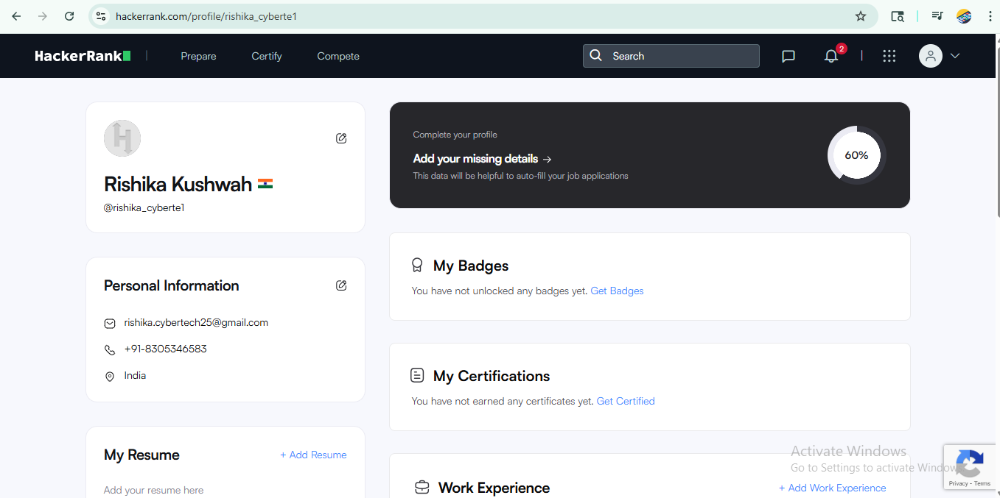
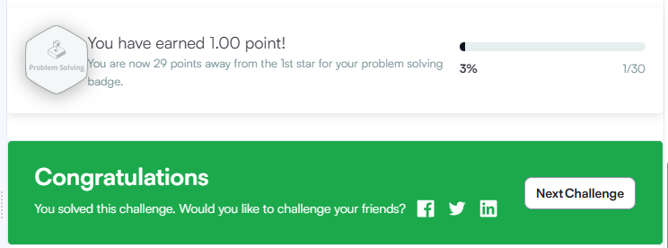
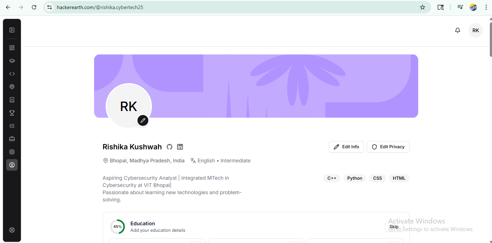
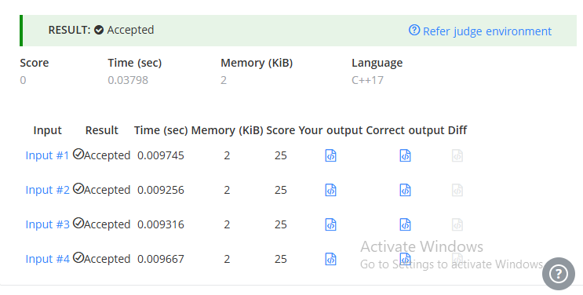
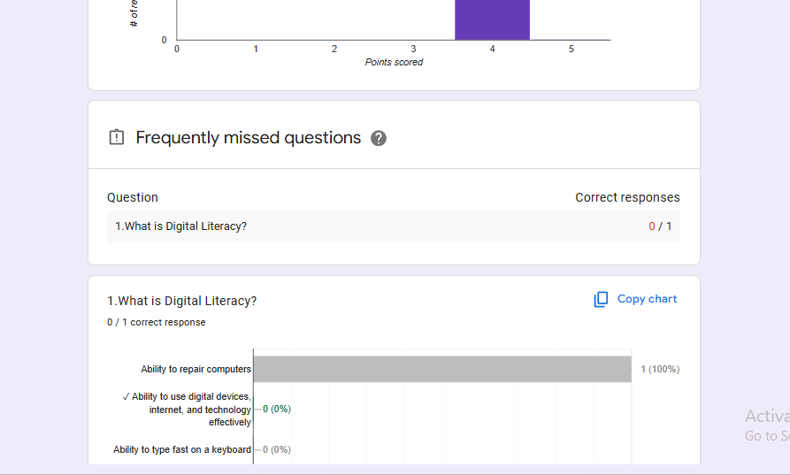
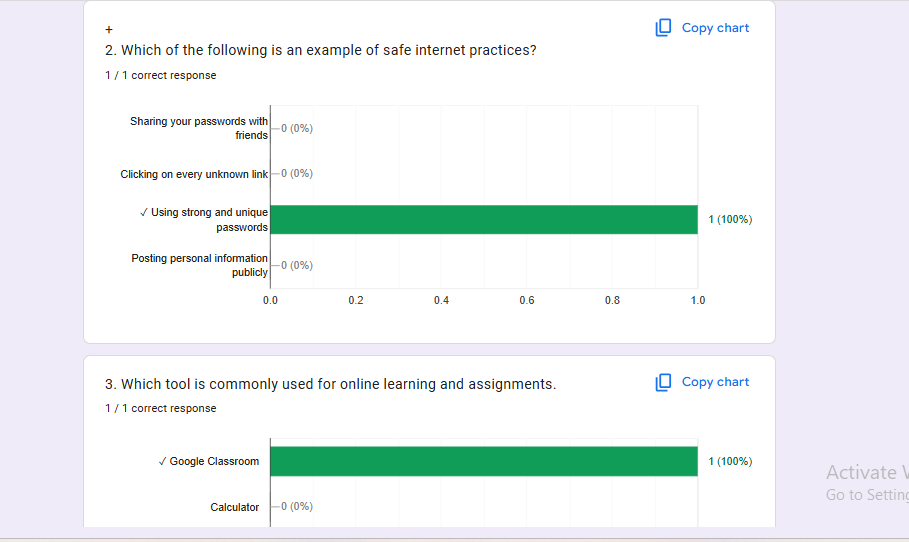
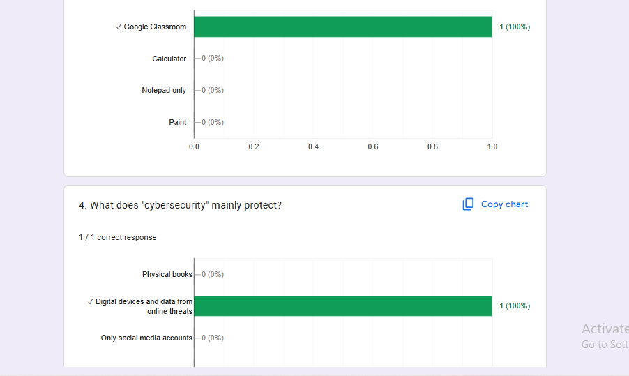
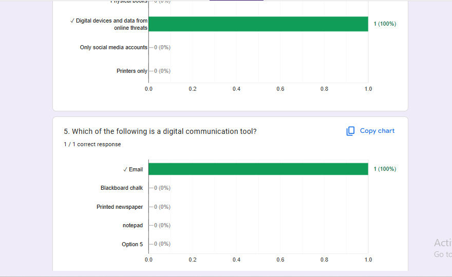

# Task 3: Coding Platforms and Digital Literacy

This task focused on setting up professional coding profiles and developing a digital literacy assessment tool using Google Forms.

## Part A: Coding Practice
I successfully registered and practiced on **HackerRank** and **HackerEarth** to strengthen my **C++17** problem-solving skills.
- **HackerRank:** Completed the 'Solve Me First' challenge.

Both platforms confirmed an "Accepted" status, passing all required test cases.

---

---

- **HackerEarth:** Solved the 'Find Product' algorithm.
---

---

---

## Part B: Digital Literacy Quiz
I designed a 5-question **Google Form** quiz covering fundamental computer topics (CPU, RAM, WWW). To manage data effectively, I linked the form to a **Google Sheet** to track live responses and analyze digital trends.

---

## Conclusion
This task improved my proficiency in competitive programming environments and demonstrated the effective use of digital survey tools for data collection and analysis.